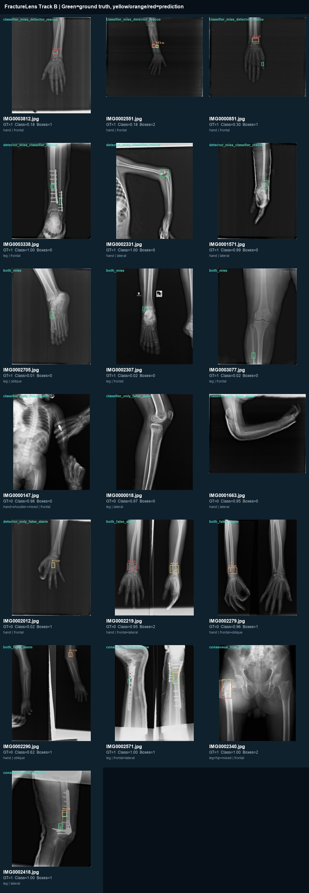
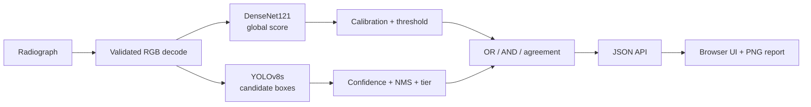

# FractureLens

[](https://github.com/BurakKocDev/FractureLens/actions/workflows/ci.yml)
[](https://github.com/BurakKocDev/FractureLens/security/code-scanning)
[](https://github.com/BurakKocDev/FractureLens/releases/latest)
[](LICENSE)

FractureLens is an end-to-end research prototype for global fracture
classification, local fracture detection, calibrated confidence, and explicit
model-disagreement analysis on musculoskeletal radiographs.

> **Research use only.** FractureLens is not a medical device and must not be
> used for diagnosis, treatment, patient triage, or autonomous clinical
> decisions.

## What is complete

- Integrity-checked FracAtlas v7 acquisition and structured data audit
- Exact- and near-duplicate-aware frozen train/validation/test manifest
- Positive-only detection and instance-segmentation reproduction track
- Full-dataset calibrated DenseNet121 classification benchmark
- Negative-aware YOLOv8s localization benchmark
- OR/AND fusion with visible global-local disagreement states
- Validation-derived box confidence tiers and duplicate-box suppression
- FastAPI inference service, browser UI, annotated preview, and PNG export
- Reproducible test error taxonomy and qualitative gallery
- Automated tests, linting, model hash verification, and GitHub Actions CI

## Headline results

All thresholds and model-selection decisions were made on validation before the
frozen 799-image test split was evaluated.

### Classification and detection

| Model | Primary test results |
| --- | --- |
| DenseNet121 classifier | AUROC **0.912**, AUPRC **0.781**, sensitivity **0.773**, specificity **0.881**, ECE **0.057** |
| YOLOv8s detector | mAP50 **0.479**, mAP50-95 **0.195**, fixed-threshold lesion sensitivity **0.449** |
| YOLO negative-image safety | **0.76%** of 658 negative images contain any false local alarm |
| Inference NMS 0.50 | precision **0.738**, lesion sensitivity **0.432**, F1 **0.545** |

The inference NMS line is a validation-selected presentation post-processing
result and does not replace the canonical confidence-swept mAP report.

### Global-local fusion

| Policy | Sensitivity | Specificity | Balanced accuracy |
| --- | ---: | ---: | ---: |
| DenseNet classifier | 0.773 | 0.881 | 0.827 |
| Detector image evidence | 0.532 | 0.992 | 0.762 |
| OR fusion | **0.865** | 0.880 | **0.873** |
| AND fusion | 0.440 | **0.994** | 0.717 |

The models agree on 83.1% of test images. Agreement-only selective reporting
covers 83.1% at 96.5% retrospective accuracy. This does not establish clinical
safety; the interface keeps disagreements visible for review.

## Error gallery

Green boxes are dataset ground truth. Yellow, orange, and red boxes are low-,
medium-, and high-confidence detector candidates. Colors indicate model
confidence—not fracture severity.



The full taxonomy and generation method are documented in
[the fused error analysis](docs/fused_error_analysis.md).

## How inference works



The classifier and detector are independent. A positive global score can occur
without a box, and a local box can occur below the classifier threshold. The
fusion layer reports these cases rather than inventing a location or discarding
local evidence. See the [architecture document](docs/architecture.md) for the
complete data and runtime flow.

## Quick start

Use Python 3.11 or later. On Windows PowerShell:

```powershell
python -m venv .venv
.\.venv\Scripts\Activate.ps1
python -m pip install --upgrade pip
python -m pip install -e ".[vision,service]"
```

Raw data and model binaries are intentionally excluded from Git. The trained
weights must exist at the paths frozen in
`configs/inference/track_b_fused.json`. Verify both files and their SHA-256
digests before starting the service:

```powershell
python scripts/check_inference_bundle.py
```

Start the local application:

```powershell
python scripts/run_api.py --host 127.0.0.1 --port 8000
```

Open:

- Browser interface: <http://127.0.0.1:8000/>
- Interactive API documentation: <http://127.0.0.1:8000/docs>
- Health endpoint: <http://127.0.0.1:8000/health>

The browser accepts JPEG, PNG, and WebP files up to 25 MiB. It displays the
calibrated global score, candidate boxes, local confidence tier, agreement
state, and an exportable visual report.

### CLI inference

```powershell
python scripts/predict_fracture.py radiograph.jpg `
  --output-json result.json `
  --overlay overlay.jpg
```

### API inference

```powershell
curl.exe -X POST http://127.0.0.1:8000/v1/predict `
  -H "accept: application/json" `
  -F "file=@radiograph.jpg;type=image/jpeg"
```

## Decision states

| Classifier | Local evidence | Interface meaning |
| --- | --- | --- |
| Positive | Present | Global and local signals agree |
| Positive | Absent | Global signal without a defensible location |
| Negative | Present | Local candidate below the global decision threshold |
| Negative | Absent | Neither model crosses its frozen threshold |

None of these states is a medical conclusion. In particular, no box does not
rule out a fracture: fixed-threshold lesion sensitivity remains limited.

## Dataset and split protocol

The project pins FracAtlas v7 to DOI
[`10.6084/m9.figshare.22363012.v7`](https://doi.org/10.6084/m9.figshare.22363012.v7).
The record and paper report different image totals, so project counts come from
the audited archive rather than copied metadata.

| Frozen split | Images | Positive | Negative |
| --- | ---: | ---: | ---: |
| Train | 2,784 | 485 | 2,299 |
| Validation | 395 | 68 | 327 |
| Test | 799 | 141 | 658 |

The clean manifest contains 3,978 images after duplicate and label-conflict
handling. Cross-split duplicate-group and exact-pixel violations are both zero.
FracAtlas does not provide patient identifiers, so this is not a guaranteed
patient-independent split.

## Reproducibility

The repository keeps code, manifests, configuration, checksums, and reports in
Git while excluding raw images, weights, and generated runs.

Core data preparation:

```powershell
python scripts/download_fracatlas.py
python scripts/inspect_fracatlas.py
python scripts/build_cleaning_manifest.py
python scripts/create_split_manifest.py
python scripts/smoke_test_dataset.py
```

The trainers refuse silent CPU fallback for GPU experiments, record Git and
environment provenance, use the frozen manifest, and refuse to overwrite an
existing named run. Exact experiment commands and results live in the linked
logs below.

Run local quality checks:

```powershell
python -m pip install -e ".[dev,service]"
python -m ruff check src tests scripts
python -m pytest -q
```

## Repository map

```text
configs/       Frozen data, experiment, and inference configuration
docs/          Dataset, experiment, architecture, and error-analysis reports
manifests/     Audited duplicate-aware split and exclusions
scripts/       Download, preparation, training, evaluation, and serving commands
src/           Reusable data, evaluation, inference, and API modules
tests/         Unit and service tests that do not require model weights
artifacts/     Local weights, runs, reports, and generated images (Git-ignored)
```

## Documentation

- [Model card](MODEL_CARD.md)
- [Türkçe nihai proje özeti](docs/project_summary_tr.md)
- [Architecture and trust boundaries](docs/architecture.md)
- [Dataset card](docs/dataset_card.md)
- [Data audit](docs/data_audit_report.md)
- [Study protocol](docs/study_protocol.md)
- [Track A experiment log](docs/track_a_experiment_log.md)
- [Track A error analysis](docs/track_a_error_analysis.md)
- [Track B classification log](docs/track_b_experiment_log.md)
- [Track B detection and consistency log](docs/track_b_detection_log.md)
- [Fused error analysis](docs/fused_error_analysis.md)

## Known limitations

- Single-dataset retrospective evaluation; no external or prospective test
- No patient identifiers, demographics, acquisition metadata, or original DICOM
- Possible shortcut learning from borders, text, multi-view panels, and hardware
- Limited and unstable estimates for small anatomy/view subgroups
- More than half of annotated lesions are missed at the fixed detector threshold
- No out-of-distribution or automated image-quality rejection
- Model confidence tiers are not calibrated clinical probabilities

## Attribution and licenses

FracAtlas is available under CC BY 4.0:

> Abedeen I, Rahman MA, Prottyasha FZ, et al. *FracAtlas: A Dataset for
> Fracture Classification, Localization and Segmentation of Musculoskeletal
> Radiographs.* Scientific Data. 2023;10:521.
> <https://doi.org/10.1038/s41597-023-02432-4>

The committed gallery is an attributed derivative of FracAtlas. FractureLens
source code is released under the [MIT License](LICENSE).
