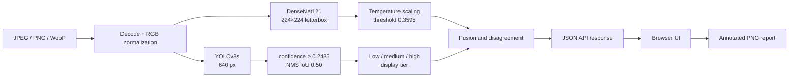
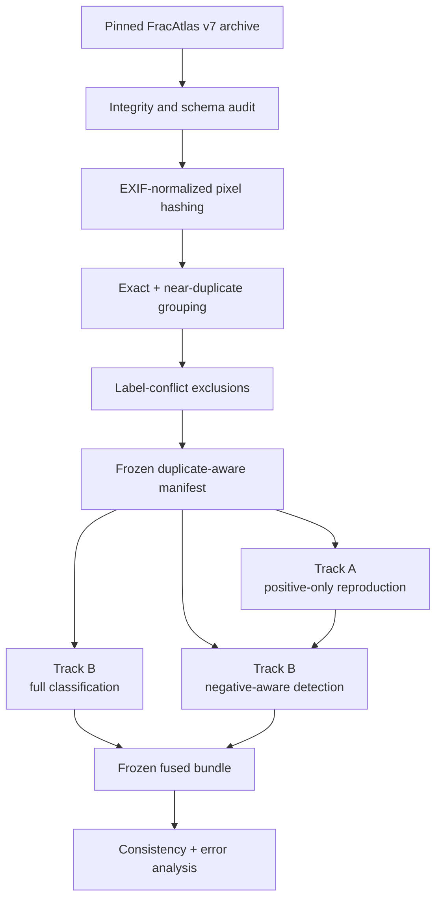

# FractureLens Architecture

## Inference path

The classifier answers whether the complete radiograph contains a global
fracture signal. The detector independently proposes local regions. OR fusion
is retained as the sensitive research view; AND is exposed as the strict view.
Disagreement becomes an explicit review state rather than being silently
resolved.

## Data and experiment path

## Runtime components

| Component | Responsibility |
| --- | --- |
| `inference/pipeline.py` | Loads verified weights and runs both models |
| `inference/decision.py` | Produces OR, AND, agreement, and review states |
| `inference/confidence.py` | Applies validation-derived display tiers |
| `service/app.py` | Validates uploads and exposes FastAPI endpoints |
| `service/static/index.html` | Local upload, visualization, and PNG export UI |
| `configs/inference/track_b_fused.json` | Freezes weights, hashes, thresholds, and NMS |

## Trust boundaries

1. Upload validation limits format and size but does not assess radiographic
   quality or whether an image is in distribution.
2. SHA-256 checks prevent silently loading different model binaries.
3. Thresholds and post-processing choices are validation-derived and frozen.
4. The API returns evidence and disagreement; it does not make a clinical
   recommendation.
5. Raw data and weights remain local and are not committed to the repository.
