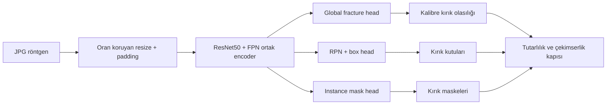

# FractureLens Araştırma ve Uygulama Planı

## Yönetici kararı

FractureLens, yalnızca “röntgende kırık var mı?” sınıflandırıcısı olmayacaktır. Projenin ana çıktısı; aynı dondurulmuş değerlendirme kümesinde görüntü düzeyi sınıflandırma, kırık kutusu, kırık maskesi, olasılık kalibrasyonu ve gerektiğinde tahminden çekinme davranışını birlikte inceleyen yeniden üretilebilir bir araştırma ve karar-destek prototipidir.

Projeyi farklılaştıracak ana unsur daha yeni bir YOLO sürümü kullanmak değil; **duplikasyon-duyarlı veri bölme, negatif görüntüler üzerinde yanlış alarm ölçümü, ortak görev değerlendirmesi ve global karar ile lokal kanıtın tutarlılığıdır**.

Önerilen ana model adayı şudur:

> **FractureLens-MTL:** ResNet50-FPN tabanlı Mask R-CNN'in kutu ve maske başlıklarına, görüntü düzeyi kırık sınıflandırma başlığı eklenen çok görevli model.

Bu aday; bağımsız DenseNet121 sınıflandırma, YOLOv8s detection ve YOLOv8s-seg/DeepLabV3+ segmentation baseline'larıyla aynı test manifestinde karşılaştırılacaktır.

## 1. Veri setinin doğrulanmış profili

FracAtlas, Bangladeş'teki üç sağlık merkezinden toplanan 14.068 röntgenden seçilmiş 4.083 kas-iskelet röntgeni içerir. Veriler JPG biçimindedir; hasta adı, yaş, cinsiyet ve zaman gibi yapılandırılmış kimlik/meta verileri yayımlanmamıştır. 12 Eylül 2026'da indirilen v7 arşivinin kanonik `dataset.csv` dosyasında 719 kırıklı görüntü ve COCO dosyasında 924 kırık örneği doğrulanmıştır. Bunlar makaledeki 717/922 değerlerinden ve v7 açılış sayfasındaki hatalı 4.073 toplamından farklıdır; deneylerde arşiv içeriği esas alınacaktır.[^1]

| Özellik | Doğrulanmış değer | Projeye etkisi |
|---|---:|---|
| Toplam görüntü | 4.083 | Küçük/orta ölçek; tek GPU ile uygulanabilir |
| Kırıklı görüntü | 719 (%17,6) | Güçlü sınıf dengesizliği var |
| Kırık örneği | 924 | Bir görüntüde 1–5 kırık olabilir |
| El | 1.538 görüntü / 437 kırıklı | Pozitiflerin çoğu bu bölgede |
| Bacak | 2.272 / 263 kırıklı | En büyük bölge, daha düşük pozitif oranı |
| Kalça | 338 / 63 kırıklı | Küçük alt grup; belirsizlik geniş olacak |
| Omuz | 349 / 63 kırıklı | Küçük alt grup; ayrı raporlanmalı |
| Çoklu görünüm/montaj | 396 görüntü | Crop ve yeniden boyutlandırma riski |
| Ortopedik donanım | 99 görüntü | Güçlü shortcut/karıştırıcı aday |
| Görünüm etiketleri | frontal 2.503, lateral 1.492, oblique 418 | Dilim bazlı değerlendirme olanağı |
| Formatlar | CSV, COCO, VGG, YOLO, Pascal VOC | Üç görevi aynı kaynak üzerinden kurabiliriz |
| Boyut | yaklaşık 323 MB | Hızlı veri kapısı ve CI smoke test mümkün |
| Lisans | CC BY 4.0 | Atıfla kullanım/uyarlama mümkün |

Figshare kaydı kayıt gerektirmeden indirme ve CC BY 4.0 kullanımını belirtir.[^2] Resmî klasör yapısında `images`, `Annotations`, `Utilities` ve `dataset.csv` bulunur. COCO/VGG poligonları segmentation; YOLO/VOC kutuları localization; CSV ise global sınıf, anatomik bölge, görünüm, hardware, multiscan ve fracture count gibi görevlerde kullanılabilir.[^1]

### Veri setinin kritik sınırlılıkları

1. **Hasta kimliği yoktur.** Aynı hastaya ait farklı görüntülerin bölümler arasında kalmadığını kesin olarak kanıtlayamayız.
2. **Birebir kopyalar vardır.** 2026 tarihli FAD-MIL çalışması MD5 kontrolüyle 12 grup içinde 15 fazla kopya görüntü bulmuş ve 4.068 benzersiz görüntüyle çalışmıştır.[^3]
3. **Yakın kopya riski sürer.** Crop, yeniden kodlama veya farklı pencereleme ile benzer görüntüler MD5'e yakalanmayabilir.
4. **Metin/logo ve çekim artefaktları vardır.** Orijinal veri makalesi bazı görüntülerde logo ve metinlerin bırakıldığını açıkça belirtir.[^1] Modelin hastane/cihaz/yazı kestirmesi öğrenme riski ölçülmelidir.
5. **Demografik etiketler görüntü düzeyinde yayımlanmamıştır.** Makale toplu yaş/cinsiyet dağılımı verse de adil performans analizi için bireysel demografi yoktur.
6. **DICOM yoktur.** JPG dönüşümü gerçek klinik DICOM iş akışını, bit derinliğini ve acquisition metadata'sını temsil etmez.
7. **Pozitif alt kümeler arasında ciddi dengesizlik vardır.** Özellikle kalça ve omuz performansındaki farkların güven aralıkları geniş olabilir.

Bu nedenle proje “klinik tanı modeli” olarak değil, açık veri üzerinde yöntem ve güvenilirlik araştırması olarak sunulacaktır.

## 2. FracAtlas üzerinde bugüne kadar neler yapılmış?

Farklı çalışmalar farklı veri bölümleri, anatomik kapsamlar, augmentation yöntemleri ve metrikler kullandığı için aşağıdaki sayılar tek bir liderlik tablosu değildir. Her sonuç kendi protokolü içinde okunmalıdır.

| Çalışma | Görev ve modeller | Bildirilen sonuç / katkı | Bizim yorumumuz |
|---|---|---|---|
| FracAtlas teknik doğrulaması, 2023 | YOLOv8s detection; YOLOv8s-seg instance segmentation | Detection: precision 0,807, recall 0,473, mAP50 0,562. Segmentation mask: precision 0,830, recall 0,499, mAP50 0,589. Resmî notebook 30 epoch ve 600 px kullanır. Güncel v7 pozitif bölümü 574/82/63'tür.[^1][^8] | İlk yeniden üretim hedefidir; fakat negatif görüntü görmeyen detector'ın gerçek yanlış alarm yükünü ölçmez. |
| Zou & Arshad, 2024 | YOLOv4/5/7/8, SSD, Faster R-CNN, Mask R-CNN; attention + EIoU kullanan YOLOv7-ATT | Özel veri üzerinde mAP 0,802; FracAtlas genelleme deneyinde mAP 0,862 bildirilmiştir.[^4] | Güçlü detection referansı; fakat eğitim verisi/split ve dış değerlendirme protokolü resmî baseline ile aynı değildir. |
| Turk ve ark., 2024 | DeepLabV3 + ResNet50, ResNet101 ve MobileNetV3 encoder | 575/83/61 pozitif görüntü, original/augmented/cropped varyantları; original sette 0,93 üzeri IoU ve cropped varyantta 0,99'a varan AUC bildirilmiştir.[^5] | Segmentation mimarisi için yararlı; arka plan baskın pixel metrikleri, crop kullanımı ve farklı veri türevleri nedeniyle sonuçları bağımsız testte yeniden ölçmek gerekir. |
| Modified YOLOv8-HA, 2024 | YOLOv8'e kanal + uzamsal hybrid attention | El kırıklarında mAP yaklaşık 0,59'dan 0,71'e; mAP50'de %20, F-score'da %24 göreli iyileşme bildirilmiştir.[^6] | Küçük lezyonlarda attention hipotezini destekler; tam veri seti ana benchmark'ı değildir. |
| FAD-MIL, 2026 | Dondurulmuş ImageNet ResNet50 patch özellikleri; Mean-Pool MIL, Tile-Vote, ABMIL, global–local FAD-MIL | 15 duplikasyon çıkarıldı. FAD-MIL: AUROC 0,833, AP 0,619, F1 0,541, ECE 0,078, Brier 0,119; ABMIL AUROC 0,817 ve ECE 0,156.[^3] | En değerli metodolojik referans: yüksek accuracy iddiaları yerine duplikasyon, dengesizlik, kalibrasyon ve eşik seçimini görünür kılıyor. |
| SKELEX, 2026 | 1,29 milyon MSK röntgeninde MAE ön-eğitimli ViT; ResNet101, ViT-MAE, BiomedCLIP ve Radio-DINO karşılaştırmaları | FracAtlas sınıflandırmasında domain-specific self-supervision ve yaklaşık 0,08 ECE; ayrıca maskesiz reconstruction-error lokalizasyonu incelenmiştir.[^7] | Foundation-model encoder ileri deney olabilir; ilk MVP'nin ana modeli yapılmamalı, çünkü araştırma sorusunu ve hesaplama kapsamını büyütür. |

Resmî kod deposunda `Train_8s.ipynb` ve `Prediction_8s.ipynb` ile YOLOv8s ve YOLOv8s-seg eğitimi sunulmaktadır.[^8] Notebook komutları her iki model için 30 epoch ve 600 piksel kullanır. Ultralytics sürümü, batch, seed, optimizer ve donanım bildirilmediğinden bunlar yeniden üretilebilirlik boşluğu olarak kaydedilecek; çalışmada oluşan `args.yaml` korunacaktır.

### Literatürden çıkan net boşluk

Literatürün büyük kısmı tek görevi optimize ediyor ve farklı splitlerde tek bir performans sayısı veriyor. Açık kalan soru şudur:

> Aynı görüntü için global kırık olasılığı, lokal kutu ve piksel maskesi birlikte öğrenildiğinde; model yalnızca daha doğru değil, daha iyi kalibre ve kendi lokal kanıtıyla daha tutarlı olur mu?

FracAtlas'ın kutu, maske ve görüntü etiketi kombinasyonu bu soruyu test etmeye uygundur. Veri setinin hasta kimliği ve dış doğrulama eksikliği, sonuçların kapsamını sınırlayacaktır; bu sınırlılık saklanmayacaktır.

## 3. Bizim araştırma tasarımımız

### Ana araştırma sorusu

**Duplikasyon-duyarlı tek bir değerlendirme protokolünde ortak encoder kullanan sınıflandırma + detection + instance segmentation modeli; bağımsız göreve özel modellere kıyasla global karar–lokal kanıt tutarlılığını ve olasılık kalibrasyonunu iyileştiriyor mu?**

### Önceden tanımlanmış hipotezler

- **H1 — Lokal denetim:** Kutu ve maske kayıplarıyla eğitilen ortak modelin görüntü düzeyi AUROC/AUPRC'si bağımsız sınıflandırıcıdan en fazla küçük bir ödün verirken lokal kanıt sunma oranı daha yüksek olacaktır.
- **H2 — Tutarlılık:** Ortak model, “global pozitif ama kutu/maske yok” ve “global negatif ama yüksek güvenli lokal bulgu var” çelişkilerini azaltacaktır.
- **H3 — Kalibrasyon:** Validation setinde temperature scaling uygulanmış ortak model, bağımsız pipeline'a göre daha düşük ECE/Brier veya daha iyi risk–coverage eğrisi verecektir.
- **H4 — Negatif örnekler:** Detector/segmenter eğitimine boş hedefli negatif görüntü eklemek, pozitif-only eğitime göre negatif görüntü başına yanlış alarmı düşürecektir.
- **H5 — Artefakt dayanıklılığı:** Text/logo sınırlarını maskeleme, hardware ve anatomik bölge dilimlerinde shortcut kaynaklı performans farklarını azaltabilir; iyileştirme olmazsa sonuç nötr olarak raporlanacaktır.

### İki ayrı deney izi

#### İz A — Resmî yeniden üretim

- Resmî pozitif `train/valid/test` listeleri kullanılacak.
- YOLOv8s ve YOLOv8s-seg notebook ayarları mümkün olduğunca aynen çalıştırılacak.
- Amaç yeni sonuç iddiası değil; veri/etiket dönüşümünün ve metriğin doğru olduğunu kanıtlamak.
- Resmî makaledeki mAP50, precision ve recall değerleriyle fark raporlanacak.

#### İz B — FractureLens ana benchmark'ı

- 15 exact duplicate çıkarıldıktan ve yakın-kopya adayları gruplandıktan sonra tüm pozitif ve negatif görüntüler kullanılacak.
- Yaklaşık **%70 train / %10 validation / %20 test** ayrımı uygulanacak.
- Gruplama birimi hasta değil, doğrulanmış duplicate/near-duplicate kümesi olacaktır. Hasta kimliği olmadığı açıkça yazılacak.
- Stratification hedefleri: fracture etiketi + baskın anatomik bölge; view ve hardware dağılımı olabildiğince dengelenecek.
- Test manifesti hash'lenip dondurulacak ve model/threshold seçimi bitene kadar açılmayacak.
- Tüm modeller aynı test manifestinde değerlendirilecek.

12 Eylül 2026 veri kapısı sonunda 105 kayıt çıkarılmış, temiz 3.978 görüntü 2.784 train / 395 validation / 799 test olarak dondurulmuştur. Pozitif sayıları sırasıyla 485/68/141'dir; split grupları arasında exact-pixel veya doğrulanmış near-duplicate ihlali yoktur.

## 4. Model portföyü

### Zorunlu baseline'lar

| Kod | Görev | Model | Neden seçildi? |
|---|---|---|---|
| C0 | Classification | DenseNet121, ImageNet pretrained | Güçlü ve kolay yorumlanan CNN baseline; küçük veri için makul maliyet |
| C1 | Classification | ConvNeXt-Tiny veya DINOv2-S linear probe | Modern encoder karşılaştırması; yalnızca C0 hattı kararlıysa |
| D0 | Detection | YOLOv8s | Resmî FracAtlas sonucunu yeniden üretmek için |
| D1 | Detection | Faster R-CNN R50-FPN | İki aşamalı, açık PyTorch baseline; küçük lezyon davranışını karşılaştırmak için |
| S0 | Instance segmentation | YOLOv8s-seg | Resmî sonucu yeniden üretmek için |
| S1 | Semantic segmentation | DeepLabV3+ ResNet50 | Literatürde FracAtlas üzerinde kullanılmış, ayrı segmentation kontrolü |

İlk turda C1 zorunlu değildir. Çok sayıda backbone denemek yerine veri ve ölçüm güvenilirliği önceliklidir.

### Ana aday: FractureLens-MTL



Temel model Mask R-CNN R50-FPN olacaktır. FPN özelliklerinden global average pooling ile ikili sınıflandırma başlığı eklenecektir. Pozitif görüntüler kutu ve maskelerle; negatif görüntüler boş `boxes/labels/masks` hedefleriyle eğitime girer.

Toplam kayıp:

\[
L = L_{rpn} + L_{box} + L_{mask} + \lambda_{cls} L_{global}
\]

`lambda_cls` yalnızca train/validation üzerinde seçilecek; başlangıç değerleri 0,5, 1,0 ve 2,0 ile sınırlı küçük bir ablation olacaktır. Ana model kilitlendikten sonra test setine bir kez bakılacaktır.

### Neden YOLO11 veya özel attention modeli ana yenilik değil?

- Sürüm değişikliği tek başına bilimsel katkı değildir.
- Küçük veri ve farklı splitler, mimari kazancı kolayca olduğundan büyük gösterebilir.
- Özel YOLO türevleri üç görev arasında global–lokal tutarlılığı doğrudan test etmez.
- İlk projenin asıl değeri yeniden kullanılabilir, denetlenebilir araştırma altyapısıdır.

YOLO11s veya RT-DETR, yalnızca zaman kalırsa “modern detector sanity check” olarak eklenebilir; ana sonuç bunlara bağlanmayacaktır.

## 5. Veri işleme ve sızıntı önleme

### 5.1 Veri bütünlüğü

- Arşiv URL'si, Figshare sürümü, dosya boyutu, indirme tarihi ve SHA-256 hash kaydedilecek.
- Her JPG'nin açılabildiği, boyutları, kanal modu ve dinamik aralığı raporlanacak.
- `dataset.csv` içindeki her görüntü adı dosya sisteminde birebir bulunacak.
- COCO image id/file name, polygon, bbox ve area alanları görüntülerle doğrulanacak.
- Poligonların self-intersection, sıfır alan, görüntü dışına taşma ve bozuk RLE/polygon durumu kontrol edilecek.
- COCO poligonundan yeniden üretilen bbox, yayımlanan YOLO/VOC bbox ile tolerans içinde karşılaştırılacak.

### 5.2 Duplikasyon protokolü

1. Dosya hash'i ve decode edilmiş piksel hash'i ile exact duplicate bul.
2. pHash/dHash ile aday yakın-kopya çiftleri üret.
3. Aynı anatomi etiketi içindeki adaylarda SSIM ve feature cosine similarity hesapla.
4. Yüksek benzerlikli adayları kontakt sheet üzerinde elle doğrula.
5. Aynı duplicate kümesini tek splitte tut.
6. Çıkarılan ve gruplandırılan dosyaları `duplicate_audit.csv` içinde gerekçesiyle kaydet.

Hasta kimliği olmadığı için bu işlem patient-level split değildir; yalnızca kanıtlanabilir görüntü sızıntısını azaltır.

### 5.3 Preprocessing

- Oranı koruyan resize + padding; görüntüyü kareye esnetme yok.
- Classification başlangıç çözünürlüğü 512; detection/segmentation 640 ve gerekirse 1024 karşılaştırması.
- Gri görüntü pretrained encoder için üç kanala kopyalanabilir; orijinal intensity dağılımı ayrıca korunur.
- CLAHE/histogram equalization varsayılan değil, ablation olacaktır.
- Güvenli augmentation: küçük rotasyon, hafif ölçek/translation, gamma/contrast, sınırlı noise/blur.
- Anatomik anlamı bozabilecek agresif crop veya dikey flip kullanılmayacak.
- Augmentation yalnızca train splitinden sonra, çevrimiçi uygulanacak.

### 5.4 Artefakt ve shortcut deneyi

- OCR/border-density ile text/logo içeren bölgeler işaretlenecek.
- Orijinal görüntü ve text-border masked görüntü üzerinde aynı kilitli model karşılaştırılacak.
- Hardware bulunan 99 görüntü ayrı dilim olarak raporlanacak.
- Background-only veya border-only sınıflandırıcı bir shortcut sanity check olarak çalıştırılacak.

## 6. Değerlendirme planı

### Classification

- AUROC ve özellikle dengesiz veri için AUPRC
- Sensitivity, specificity, balanced accuracy, precision, F1
- Validation'da seçilmiş iki işletim noktası: F1-optimal ve yüksek-sensitivity hedefi
- ECE, adaptive ECE, Brier score ve reliability diagram
- Temperature scaling öncesi/sonrası sonuç

### Detection

- mAP50 ve mAP50–95
- Lesion-level sensitivity
- FROC: görüntü başına 0,25 / 0,5 / 1 / 2 yanlış pozitifte sensitivity
- Negatif görüntü başına yanlış pozitif kutu
- Küçük/orta/büyük lezyon AP'si; boyut eşikleri veriden quartile ile tanımlanacak

### Segmentation

- Pozitif görüntülerde Dice ve IoU
- Boundary F1 ve HD95
- Lesion-level yakalama oranı
- Negatif görüntülerde boş maske doğruluğu, yanlış pozitif piksel oranı ve herhangi bir maske üretme oranı

### Tutarlılık metrikleri

- Global pozitif + lokal kanıt yok oranı
- Global negatif + yüksek güvenli kutu/maske var oranı
- Global olasılık ile maksimum detector skoru korelasyonu
- Global olasılık ile maskelenen alan/lesion confidence ilişkisi
- Lokal kanıt zorunluyken sensitivity ve yanlış alarm değişimi

### Güvenilirlik ve çekimserlik

- En düşük güvenli örneklerin %5, %10, %20'sinden çekinildiğinde risk–coverage eğrisi
- Çekimserlik nedenleri: düşük calibrated confidence, görevler arası çelişki, kalite/artefakt uyarısı, kapsam dışı anatomi
- Kullanıcıya “kırık yok” yerine “model güvenilir karar veremedi” sonucu gösterebilme

### Dilimler

- El / bacak / kalça / omuz
- Frontal / lateral / oblique
- Hardware var / yok
- Multiscan var / yok
- Lezyon alanı quartile'ları
- Görüntü çözünürlüğü ve kalite quartile'ları

### İstatistik

- Tüm ana metrikler için 1.000 tekrarlı nonparametric bootstrap %95 güven aralığı
- Aynı test örneklerinde AUROC karşılaştırması için DeLong; threshold metrikleri için eşleştirilmiş bootstrap
- Çoklu ablation sonuçları keşifsel olarak etiketlenecek; p-değeri tek başına karar ölçütü olmayacak
- Test seti ana model ve eşikler kilitlenmeden açılmayacak

## 7. Önceden belirlenmiş model seçme kuralı

FractureLens-MTL “kazandı” sayılmak için bütün metriklerde en yüksek olmak zorunda değildir. Aşağıdaki bileşik kapı kullanılacaktır:

1. Classification AUROC'si C0'a göre 0,02'den fazla düşmeyecek.
2. Detection mAP50–95'i D0/D1'in en iyisine göre 0,03'ten fazla düşmeyecek.
3. Segmentation Dice'ı S0/S1'in en iyisine göre 0,03'ten fazla düşmeyecek.
4. Görev çelişkisi veya ECE'de anlamlı ve bootstrap güven aralığıyla desteklenen iyileşme gösterecek.
5. Tek model servis etmenin latency/bellek avantajı ölçülecek.

Kapı geçilmezse sonuç başarısızlık değil, “ayrı modeller daha güvenilir” bilimsel bulgusudur. Ürün pipeline'ı en iyi ayrı modellerle devam eder.

## 8. Ablation sırası

Kapsamı kontrol etmek için deneyler bu sırayla yapılacaktır:

1. **Exact duplicate var/yok:** naive split ile temiz split arasındaki performans farkı.
2. **Pozitif-only vs pozitif+negatif detector eğitimi:** yanlış pozitif/görüntü etkisi.
3. **Ayrı modeller vs FractureLens-MTL.**
4. **Temperature scaling ve çekimserlik.**
5. **Text/logo masking.**
6. **512 vs 1024 çözünürlük:** yalnızca küçük lezyon recall'ı sorunluysa.
7. **Modern/foundation encoder:** yalnızca temel hipotez tamamlandıktan sonra.

Bu sıra sayesinde proje backbone yarışına dönüşmez.

## 9. Altı haftalık çalışma planı

| Hafta | Odak | Somut çıktı | Geçiş kapısı |
|---:|---|---|---|
| 1 | Veri kapısı ve EDA | Lisans kaydı, checksum, veri şeması, annotation validator, exact/near duplicate raporu, 50 örnek QA, dondurulmuş split manifesti | Görüntü–etiket eşleşmesi doğrulandı; cross-split exact duplicate sıfır |
| 2 | Yeniden üretim ve classification | Resmî YOLO notebook reproduksiyonu, DenseNet121 baseline, MLflow kayıtları, ilk hata galerisi | Tekrarlanabilir eğitim ve test scriptleri çalışıyor |
| 3 | Detection + segmentation | Full-split YOLOv8s, Faster R-CNN, YOLOv8s-seg ve DeepLabV3+ karşılaştırması | Negatiflerde FP/image ve pozitiflerde lokal metrikler hazır |
| 4 | FractureLens-MTL | Ortak encoder + global/box/mask heads; loss-weight ablation | Üç çıktı tek modelden alınabiliyor |
| 5 | Güvenilirlik | Calibration, risk–coverage, consistency, dilim ve artefakt analizleri; bootstrap CI | Ana model ve eşik seçimi donduruldu |
| 6 | Ürün ve yayın | FastAPI, React inceleme ekranı, Power BI export/modeli, Docker, test/CI, model/data cards, teknik rapor, demo, v0.1.0 | Uçtan uca örnek akış ve release tamam |

Hafta 1 sonunda veri kapısı geçmezse eğitim başlamaz. Hafta 4'te ortak model gecikirse ürün için bağımsız baseline pipeline kullanılır; araştırma kalitesi ürün demosuna feda edilmez.

## 10. Yazılım ve depo mimarisi

```text
fracturelens/
├── configs/
│   ├── data/
│   ├── model/
│   └── experiment/
├── data/                    # Git dışında
│   ├── raw/
│   ├── interim/
│   └── manifests/
├── src/fracturelens/
│   ├── data/                # ingest, validation, split, augment
│   ├── models/              # classification, detection, segmentation, MTL
│   ├── training/
│   ├── evaluation/          # metrics, calibration, bootstrap, slices
│   ├── inference/
│   └── reporting/
├── apps/
│   ├── api/                 # FastAPI
│   └── web/                 # React/Next.js inceleme ekranı
├── bi/                      # Power BI için yıldız şema ve ölçüler
├── tests/
├── docs/
│   ├── dataset_card.md
│   ├── model_card.md
│   ├── study_protocol.md
│   ├── claim_checklist.md
│   └── limitations.md
├── dvc.yaml
├── pyproject.toml
└── docker-compose.yml
```

Önerilen temel teknoloji:

- Python, PyTorch, torchvision, Albumentations ve OpenCV
- COCO değerlendirmesi için pycocotools
- MLflow deney takibi; DVC veya immutable manifest + hash veri sürümleme
- FastAPI + Pydantic; sonuç/audit kaydı için PostgreSQL
- React/Next.js web/tablet arayüzü
- Power BI için parça, görüntü, tahmin, lezyon, model sürümü ve kalite tabloları
- ONNX Runtime yalnızca ana model kilitlendikten sonra
- Pytest, Ruff, mypy ve GitHub Actions

YOLO uygulamasında kullanılan paketin lisansı, deponun açık/kapalı ve olası ticari kullanım biçimine göre sürüm sabitleme aşamasında yeniden doğrulanacaktır.

## 11. Ürün akışı

1. Araştırmacı JPG röntgen yükler.
2. Sistem format, boyut, görüntü kalitesi ve kapsam kontrolü yapar.
3. Model calibrated fracture probability, kutu ve maskeleri üretir.
4. Tutarlılık kapısı global ve lokal çıktıları karşılaştırır.
5. Uyumluysa tahmin ve lokal kanıt; uyumsuzsa “yeniden inceleme gerekli” uyarısı gösterilir.
6. Ekranda model sürümü, veri sürümü, eşik ve sınırlılık bildirimi görünür.
7. Kullanıcı model sonucunu kabul etmez; yalnızca araştırma amaçlı doğru/yanlış/kararsız değerlendirmesi ve yorumu kaydedebilir.
8. Power BI veri sağlığı, performans, kalibrasyon, hata dilimleri ve sürüm regresyonlarını gösterir.

Bu arayüz tanı koymaz, tedavi önermez ve klinik iş akışına otomatik karar göndermez.

## 12. Power BI veri modeli

### Olgu tablosu

`FactPrediction`: image_id, run_id, model_version, split, y_true, probability, threshold, decision, abstained, latency_ms, error_type.

### Alt tablolar

- `FactLesion`: image_id, lesion_id, GT/pred, confidence, bbox IoU, mask Dice, lesion_size_bin
- `DimImage`: anatomy, view, hardware, multiscan, width, height, quality flags, duplicate_group
- `DimModel`: architecture, checkpoint hash, data version, calibration version, threshold version
- `DimExperiment`: seed, config hash, commit SHA, start/end time, environment

### Panolar

1. Dataset Health
2. Classification & PR/ROC
3. Detection FROC ve FP/image
4. Segmentation ve boundary performansı
5. Calibration & Risk–Coverage
6. Consistency Errors
7. Slice Analysis
8. Model Version Regression

## 13. Başarı ve durdurma kriterleri

### Veri kapısı

- Tüm CSV görüntü adları çözüldü veya istisnalar açıkça listelendi.
- COCO poligonları ve yayımlanan kutular otomatik çapraz kontrolden geçti.
- Exact duplicate kümeleri belgelendi ve splitler arasında ayrılmadı.
- En az 50 örnek; anatomi, negatif/pozitif, hardware ve multiscan kapsayacak şekilde görsel incelendi.
- Veri lisansı/atıfı `dataset_card` içine işlendi.

### Araştırma kapısı

- Resmî YOLO baseline'ı yeniden üretildi veya sapmanın kök nedeni belgelendi.
- Tüm adaylar aynı ana test manifestinde değerlendirildi.
- Classification, detection, segmentation ve güvenilirlik metrikleri güven aralıklarıyla raporlandı.
- Ana hipotez desteklense de desteklenmese de tüm önceden belirlenmiş sonuçlar yayımlandı.
- Hasta kimliği eksikliği ve dış doğrulama yokluğu sonuç bölümünde açıkça yer aldı.

### Ürün kapısı

- Tek görüntü yükleme → kontrol → inference → overlay → audit akışı çalışıyor.
- API bozuk dosya, çok büyük dosya ve desteklenmeyen türleri reddediyor.
- Model/data/threshold sürümü her tahminle kaydediliyor.
- Test, CI, Docker ve örnek demo paketi çalışıyor.
- Depoda gerçek FracAtlas görüntüsü yeniden dağıtılmıyor; yalnızca kullanıcı üretimli/sentetik demo veya izinli küçük örnek kullanılıyor.

## 14. Makale/tez çıktısı için önerilen çerçeve

### Başlık adayı

**FractureLens: Duplicate-Aware Multi-Task Classification, Localization and Segmentation of Fractures in Musculoskeletal Radiographs**

### Birincil katkılar

1. FracAtlas için exact/near-duplicate denetimi ve yeniden kullanılabilir split manifesti.
2. Pozitif ve negatif görüntüleri aynı protokolde kullanan üç görevli adil benchmark.
3. Global sınıflandırma, kutu ve maskeyi ortak encoder ile üreten model.
4. Global–lokal tutarlılık, calibration ve selective prediction değerlendirmesi.
5. Anatomi, view, hardware, multiscan ve lezyon boyutuna göre hata analizi.
6. Kaynak kodu, konfigürasyonlar, model/data card ve araştırma amaçlı çalışan ürün demosu.

Raporlama, medikal görüntüleme AI çalışmalarında şeffaflık ve yeniden üretilebilirliği hedefleyen CLAIM 2024 ile; klinik tahmin modeli raporlaması için TRIPOD+AI maddeleriyle hizalanacaktır.[^9][^10] PROBAST+AI alanları, veri ve analiz kaynaklı yanlılıkların öz değerlendirmesinde kullanılacaktır.[^11]

## 15. Faz 0 gerçekleşen sonuçlar

- [x] Figshare v7 dosya kimliği, boyutu ve MD5 değerini doğrula
- [x] Arşivi hash kontrolünden sonra `data/raw` altına çıkar
- [x] CC BY 4.0 lisansını ve atfı veri kartına kaydet
- [x] 4.083 CSV kaydı ve 4.085 fiziksel JPG arasındaki iki çift kopyayı açıkla
- [x] COCO ↔ YOLO ↔ VOC kutu/örnek sayılarını çapraz doğrula
- [x] 59 truncated-recovered JPEG ve 25 EXIF yönelimli görüntüyü loader kuralına bağla
- [x] 12 byte-exact gruptaki 15 fazla kopyayı ve 79 pixel-exact grubu doğrula
- [x] Label-conflict exact/near bileşenlerini çıkar; aynı etiketli yakın kopyaları aynı splitte tut
- [x] 50 örneklik veri ve 20 örneklik maske QA kontakt sheet'ini görsel denetle
- [x] 3.978 görüntülük İz B manifestini üret, hash'le ve otomatik test et
- [x] EXIF/truncated-JPEG uyumlu manifest decoder'ı ve üç split için smoke batch'i çalıştır
- [x] Resmî Track A ayarlarını doğrula ve iki deney konfigürasyonunu dondur

Sıradaki iş, resmî pozitif splitini YOLO çalışma düzenine dönüştürmek ve kısa bir 1-epoch teknik prova sonrasında 30-epoch Track A detection koşusunu başlatmaktır.

Bu on madde tamamlanmadan model eğitimi başlamayacaktır.

## Sonuç

En güçlü proje, bir başka “%99 accuracy” demosu değil; FracAtlas'ın yapısal risklerini açıkça gösteren, resmî baseline'ı yeniden üreten, bütün görüntülerde yanlış alarmı ölçen ve global kararın gerçekten lokal kırık kanıtıyla desteklenip desteklenmediğini sınayan FractureLens olacaktır. Böyle kurulduğunda proje hem portföyde sınıflandırma–detection–segmentation yetkinliğini gösterir hem de makale/tez niteliğinde savunulabilir bir araştırma sorusuna sahip olur.

## Kaynaklar

[^1]: Abedeen, I. ve ark. “[FracAtlas: A Dataset for Fracture Classification, Localization and Segmentation of Musculoskeletal Radiographs](https://www.nature.com/articles/s41597-023-02432-4).” *Scientific Data* 10, 521, 2023. DOI: 10.1038/s41597-023-02432-4.
[^2]: Abedeen, I. “[FracAtlas dataset record](https://figshare.com/articles/dataset/The_dataset/22363012).” Figshare, 2023. DOI: 10.6084/m9.figshare.22363012.
[^3]: “[FAD-MIL: a weakly supervised fracture detection model based on X-ray images](https://www.nature.com/articles/s41598-026-44675-2).” *Scientific Reports*, 2026.
[^4]: Zou, J. ve Arshad, M. R. “[Detection of whole body bone fractures based on improved YOLOv7](https://doi.org/10.1016/j.bspc.2024.105995).” *Biomedical Signal Processing and Control* 91, 105995, 2024.
[^5]: Turk, S., Bingol, O., Coskuncay, A. ve Aydin, T. “[The impact of implementing backbone architectures on fracture segmentation in X-ray images](https://doi.org/10.1016/j.jestch.2024.101883).” *Engineering Science and Technology, an International Journal* 59, 101883, 2024.
[^6]: “[Deep Learning Approach for Arm Fracture Detection Based on an Improved YOLOv8 Algorithm](https://www.mdpi.com/1999-4893/17/11/471).” *Algorithms* 17(11), 471, 2024.
[^7]: Kim, S. ve ark. “[A large-scale vision foundation model for musculoskeletal radiographs](https://www.nature.com/articles/s41746-026-02826-9).” *npj Digital Medicine* 9, 668, 2026.
[^8]: XLR8-07. “[FracAtlas official technical-validation repository](https://github.com/XLR8-07/FracAtlas).” GitHub.
[^9]: Tejani, A. S. ve ark. “[Checklist for Artificial Intelligence in Medical Imaging (CLAIM): 2024 Update](https://pubs.rsna.org/doi/10.1148/ryai.240300).” *Radiology: Artificial Intelligence* 6(4), e240300, 2024.
[^10]: Collins, G. S. ve ark. “[TRIPOD+AI statement: updated guidance for reporting clinical prediction models that use regression or machine learning methods](https://www.bmj.com/content/385/bmj-2023-078378).” *BMJ* 385, e078378, 2024.
[^11]: Moons, K. G. M. ve ark. “[PROBAST+AI: an updated quality, risk of bias, and applicability assessment tool](https://www.bmj.com/content/388/bmj-2024-082505).” *BMJ* 388, e082505, 2025.
